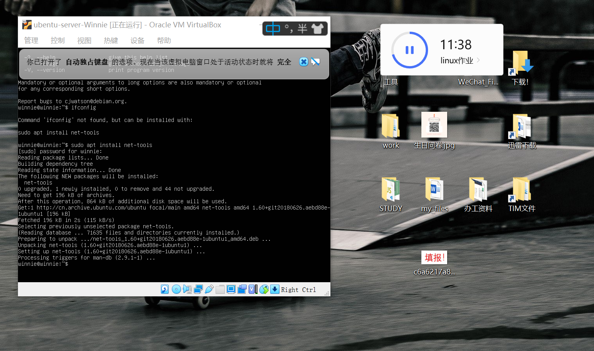
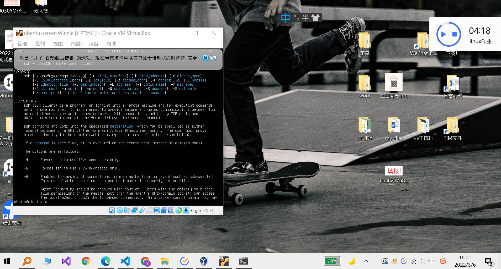
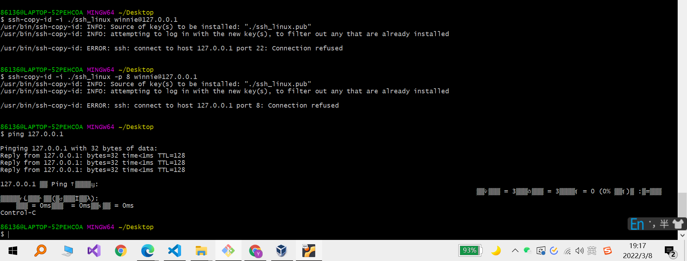
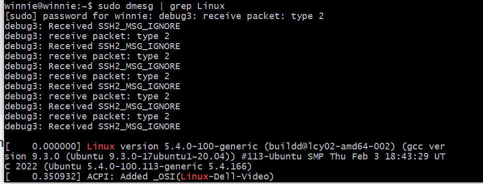

## chap0x01 
---
### homework requirements:
 

---
### 实验过程
#### 如何配置SSH免密登录
选用自己下载安装的ubentu，由于客机增强件因不明原因尚未安装成功，且黄玮老师也表示完全没有必要，所以决定先解决一下最后一个问题，完成连接（同时就把免密登录搞定）

- 首先打开自己配置的虚拟机 
   

  成功登录(这三分钟主要用于...忘记了密码... :joy:)
   
  
- 先尝试找到ubentu的ip
  ```
  ifconfig
  ```
  - 得到了反馈与上课演示相同，‘ifconfig'已经取消，但给到了解决方案
  
  
  - 根据解决方案下载工具
    ```
    sudo install net-tools
    ```
  - screenshoot of successful installing :point_down:
  

  - 紧接着成功获取ip:
  

- 尝试连接
  - 第一次尝试，显然失败，因为不知道在想啥，密码都没有怎么可能...:joy:
   
  - 第二次尝试
      -  先看了一下帮助文档
          
      -  记得原来配置过密钥对，先寻找一下，确定有没有
               
            
      - 发现了个问题就是，在这个默认生成的.ssh文件夹下，我的公私钥对和她想要的好像有出入，根据报错信息来看，显然是有相应的密钥的，但我这边的应该是 *private* & *public_key*
        

        - 原本是找到有相应的文件就以为可以使用，但根据报错的情况来看，他会自动加上 *‘.pub’* 的后缀

          目前严重怀疑这个公私钥对是在anjing的课上用‘puttygen’生成的，似乎有一定的出入（似乎之前有远程登录其他主机的时候也发现了这个问题，但记不太清了....）

        - 于是，手动查找了一下我本地的密码到底是什么情况。
          

          

          想要尝试另一个，打开config后发现，好像是之前用过的，配置过的内容，所以决定重新生成

          

          然后再一次失败。

          

          看起来，像是上一次成功的copy了？他提到了'new keys' 但我需要确认一下

      - 查询一些解决方案
        1. 端口有问题，虽然没有说明到底为什么，但可以一试？  
            
          结果：失败
        2. 也有说是因为防火墙没有关闭
          查询help 得到查询防火墙状态命令

            >  ufw status

           

           结果：防火墙处于关闭状态

            
        3. 自己直接ping了一下虚拟机，发现也不行，根据这篇帖子，了解相关内容，但我的配置按照上课演示设置，所以这里卡了很久
          - 解决过程：
            - 首先，终于发现其他问题不说，ip根本没有办法连接
              
            - 参考相关资料后，发现配置肯定没有问题，再了解了有关计算机网络的知识后，得知10.0.2.15的地址应该是nat分配的，不能用于宿主机向虚拟机传输信息
            - 且 127.0.0.1也是回环地址，所以也不是'hostonly'分配的到
            
            - 于是再次查看相关信息，觉得可能这里的意思是没有相关的设备
             
            -  仔细看了一下，原来图片中是显示了三个信息，第三个是出错的
             
            - 最终通过修改配置文件解决问题（这里确实是模仿原有的内容）
            ``` 
              sudo vim /etc/netplan/00-installer-config.yaml

              enp0s8:
                dscp4:true
            ```
            
            - 再次测试时成功找到对应ip
               

- 成功连接
  - 首先在宿主机上测试了一下
   ```
   ping 192.168.56.103
   ```
   
  - 想要复制我的公钥过去，过程也很曲折
    - 之前提到密钥的问题，已重新生成
    - 由于不知道我本地的.ssh文件中的密钥是否配置于某个项目，所以当时命名为了“ssh_linux”
    - ssh-copy-id 
      ```bash
        ssh-copy-id -i ./ssh_linux winnie@192.168.56.103 
      ```
      - 但copy成功后，可以通过ssh链接（这个肯定可以啦），但没有成功做到免密登录
     
    - 以下尝试由于过于暴躁，忘记截图
      - 怀疑1：虽然他自动添加了'.pub' 后缀，但其实复制的内容是我的私钥，只是在虚拟机上添加了后缀，所以ssh链接时，自动匹配的也是我本地的私钥，所以身份验证失败，于是修改代码
      ```bash
        ssh-copy-id -i ./ssh_linux.pub winnie@192.168.56.103 
      ```
        **失败告终**
      - 怀疑2：会不会路径有问题，就只能在.ssh文件夹内git bash（虽然这个想法很没有逻辑，但还是试了一下）
       **失败告终**
      - 怀疑3：刚刚重新复制的时候，本来虚拟机上就有文件，会不会没有复制成功啊，于是查看了一下日志，然后当时好像就是里面有一个类似'lost package'的内容，忘记截图且记不太清了，反正“包被丢了”的意思吧
        - 于是仔细查看了反馈，发现确实是已存在，就丢掉了，甚至没有覆盖，于是check了一下
         
        - 发现其实密钥是没有问题的
        - **失败告终**
      - 怀疑4：他会不会自动匹配的密钥只能叫"id_rsa"，于是尝试了一下将本地的"ssh_linux"手动重命名为了默认的"id_rsa"
        - ==结果就成功了.....==
         
    - 复盘一下为什么..感觉很匪夷所思
      - 最初是在想说，因为"ssh-copy-id"是自动配置（包括一些权限等，好像是某个帖子看见的）的，所以会不会是因为他设置的问题
      - 但想了一下说，因为check了服务器端的内容，只有一个"authorizedKeys"文件，存储了公钥，而且里面的内容也check了，多一个字废话都没有（没有相应的配置文件生成或是hash一类的认定）所以觉得应该还是ssh的问题
      - 查询了一下有关日志
        ```bash
          ssh -vvv
        ```
      - 发现他真的找到是"id_rsa"
        
      - 于是在想说，如果我需要访问多个虚拟机，但为了安全，不想用同样的密钥的话怎么办呢，所以一定是有解决方案的
      - 于是，查询了相关的配置文件，最初找到的是
       
      - 于是尝试修改了里面能打开的所有，但都**失败告终**
      - 后来突然想起来，回到/.ssh下本来就有个config，于是进入修改，发现了原来修改的痕迹，所以仿照之前的格式进行了修改（同时已将本地的"id_rsa"重命名为了"linux")
       
       结果显示成功
      - 但仔细阅读，发现他确实有用户的config还有系统的config，所以我不相信之前的所有都不起作用....
        
      - 最后的最后找到了正确的system-confi，搜索不出来是因为没有修改过，所以其实就是还没有这个文件...
     
---


#### 实现网卡系统开机自动启动且自动获取ip
其实在修改了network的设置之后就已经实现了叭
```bash
sudo vim etc/netplan/00-installer-config.yaml

# 修改为
enp0s8:
  dscp4:true
```

---
#### 查询发行版基本信息
1. 其实开机\远程连接时都会显示的
   
2. ```
   lsb_release -a
   ```
   
3. ```
   cat ~/etc/issue
   cat ~/etc/lsb-release
   ```
   

---
#### 查询发行版基本信息
1. ```bash
   uname -a
   ```
   
2. ```bash
   cat /proc/version
   ```
   
3. ```bash
   sudo dmesg | grep Linux
   ```
   
4. ```bash
   dpkg -l | grep linux-image
   ```
   

---
#### 如何使用 scp 在「虚拟机和宿主机之间」、「本机和远程 Linux 系统之间」传输文件？
```bash
# 宿主机上（客户端）
86136@LAPTOP-52PEHC0A MINGW64 ~/Desktop
$ scp scp-test winnie@192.168.56.103:~/test
scp-test: not a regular file

86136@LAPTOP-52PEHC0A MINGW64 ~/Desktop
$ scp -r scp-test winnie@192.168.56.103:~/test
test.txt                                                                                      100%   16     5.8KB/s   00:00

86136@LAPTOP-52PEHC0A MINGW64 ~/Desktop
$ ssh winnie@192.168.56.103
Welcome to Ubuntu 20.04.3 LTS (GNU/Linux 5.4.0-100-generic x86_64)

 * Documentation:  https://help.ubuntu.com
 * Management:     https://landscape.canonical.com
 * Support:        https://ubuntu.com/advantage

  System information as of Wed 09 Mar 2022 03:31:13 PM UTC

  System load:  0.0                Processes:               128
  Usage of /:   31.1% of 18.57GB   Users logged in:         1
  Memory usage: 40%                IPv4 address for enp0s3: 10.0.2.15
  Swap usage:   0%                 IPv4 address for enp0s8: 192.168.56.103

 * Super-optimized for small spaces - read how we shrank the memory
   footprint of MicroK8s to make it the smallest full K8s around.

   https://ubuntu.com/blog/microk8s-memory-optimisation

43 updates can be applied immediately.
To see these additional updates run: apt list --upgradable

Failed to connect to https://changelogs.ubuntu.com/meta-release-lts. Check your Internet connection or proxy settings


Last login: Wed Mar  9 15:18:21 2022
winnie@winnie:~$ ls
test
winnie@winnie:~$ cat test
cat: test: Is a directory
winnie@winnie:~$ cd test
winnie@winnie:~/test$ ls
scp-test
winnie@winnie:~/test$ cat scp-test/
cat: scp-test/: Is a directory
winnie@winnie:~/test$ vim scp-test/

/bin/bash: q: command not found

shell returned 127

Press ENTER or type command to continue

Press ENTER or type command to continue
winnie@winnie:~/test$ mkdir linux-to-win.txt
winnie@winnie:~/test$ ls
linux-to-win.txt  scp-test
winnie@winnie:~/test$ exit
logout
Connection to 192.168.56.103 closed.

86136@LAPTOP-52PEHC0A MINGW64 ~/Desktop
$ scp -r winnie@192.168.56.103:~/test
usage: scp [-346ABCpqrTv] [-c cipher] [-F ssh_config] [-i identity_file]
            [-J destination] [-l limit] [-o ssh_option] [-P port]
            [-S program] source ... target

86136@LAPTOP-52PEHC0A MINGW64 ~/Desktop
$ scp -r winnie@192.168.56.103:~/test  scp-test
test.txt                                    
```


#### 附加一个交作业的过程...
反正就是也很曲折 :rage:
- 反正学习成本还是有的那么久..:sob:
- 老师发的b站链接中的视频，大概讲了一下，但具体操作，怎么提交成那个很漂亮的branch，我依稀仿佛记得是在视频中说有个助教师姐发了什么什么视频已经很清楚，然后里面好像是语雀的链接...就是看不到的意思...:sob:
- 看了很久branch的教程，现在脑子有点乱，其实不是很清楚，所以也就当提问放这儿啦，不知道对不对 :point_down:
- > 我的理解是，从本地新建的branch其实也还在本地，push的时候呢，如果在一个新的分支，需要用 "push --set-upstrem origin [newbranch]"来创建远端的新分支
- >> 但是其实不是那么理解这个“origin”， 我将其理解为一个指向原来分支的指针（我通过实验测试觉得好像是 :joy:)，就是原本从哪个分支 “checkout”出来的，就是从哪个分支下新建分支

- 整个过程或者说常用命令
- ```bash
  # 初始化仓库
  git init 
  git branch -m master # 创建一个分支，仓库刚建成，所以就是主分支
  # 写个仓库的README.md
  git add -A # 添加所有文件
  git commit -m "repository of my linux homework"
  git remote add [name] [url]
  git push
  # 初始化完成
   
  git checkout -b [newbranch] # 新建分支

  git branch # 查看分支

  git add -A
  git commit -m [message]
  git push --set-upstream origin [newbranch] # 提交到远端的新分支
  ```

- 小小插曲：第一次push的时候卡了很久，就是访问不了，结果就单纯的我家断网了（气的想死啊 :rage:

---
### 问题总结与反思
1. 网卡的设置（已在实验过程中列出解决方案）
2. ssh免密登录时密钥文件和config的问题（已在实验过程中列出解决方案）
3. 下回一定按照老师的顺序做作业....想先完成最后一个，但其实本来就要解决前面的一些问题，就是直接放弃“搭的桥”，就是一整个没过河就开始拆桥
4. 整个实验过程思路很混乱，一会儿这儿一会儿那的，下次可以先想清楚过程，有个outline再开始
---
### reference (partial)
[VirtualBox Ubuntu16虚拟机网络环境NAT/Host Only模式](https://blog.csdn.net/weixin_38044597/article/details/106478977)

[解决 Ubuntu 网络模式 hostonly 对应的 网卡 没有分配ip地址的情况](https://blog.csdn.net/xulilinman/article/details/82821554)

[10.0.2.15ip地址——VirtualBox安装Lunix系统ip地址的问题](https://blog.csdn.net/u014581901/article/details/77771505)

[彻底明白ip地址，区分localhost、127.0.0.1和0.0.0.0](https://www.jianshu.com/p/ad7cd1d5be45)

[能ping得通服务器但却ssh不了的原因](https://blog.csdn.net/u013042928/article/details/79225777)

[linux(18)-解决本机ssh远程登录失败的问题 ssh: connect to host 192.168.1.3 port 22: Connection refused](https://www.cnblogs.com/yiyaxuan/p/12634565.html)  

[common issue : ssh: connect to host 10.0.2.15 port 22: Connection refused](https://askubuntu.com/questions/1046736/common-issue-ssh-connect-to-host-10-0-2-15-port-22-connection-refused)

[ubuntu官方文档之防火墙篇](http://manpages.ubuntu.com/manpages/bionic/man8/ufw.8.html?_ga=2.85812377.1242763031.1646741474-2081316074.1645407211)

[VirtualBox Ubuntu16虚拟机网络环境NAT/Host Only模式](https://blog.csdn.net/weixin_38044597/article/details/106478977)

[Ubuntu 通过 Netplan 配置网络教程](https://segmentfault.com/a/1190000040728591)

[Ubuntu20.04网络配置](https://www.360blogs.top/ubuntu20-04-netplan/)

[How to Enable/Disable UFW Firewall on Ubuntu 18.04](https://phoenixnap.com/kb/how-to-enable-disable-firewall-ubuntu)

[SSH Over VBox NAT NOT Working Ubuntu 20.04 Host (desktop) Ubuntu 20.04 server (guest)](https://askubuntu.com/questions/1106471/destination-unreachable-when-setting-up-host-only-networking)

[How to set up NAT and Host-Only networking with static IP address in VirtualBox](https://askubuntu.com/questions/446183/how-to-set-up-nat-and-host-only-networking-with-static-ip-address-in-virtualbox)

[VirtualBox host-only network - ssh to remote machine](https://code-maven.com/virtualbox-host-only-network-ssh-to-remote-machine)

[补充资料](https://c4pr1c3.github.io/LinuxSysAdmin/get-networks-done-asap.md.html#/title-slide)

[How to undo an ssh-copy-id?](https://askubuntu.com/questions/317619/how-to-undo-an-ssh-copy-id)

[ssh doc](https://www.ssh.com/academy/ssh/copy-id)

[openssh](https://www.openssh.com/manual.html)

[OpenBSD manual page server](https://man.openbsd.org/ssh_config)