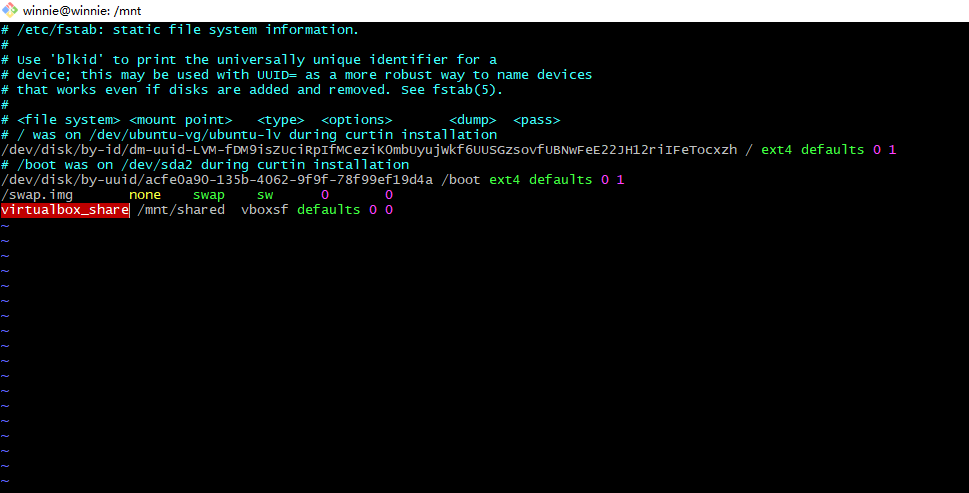
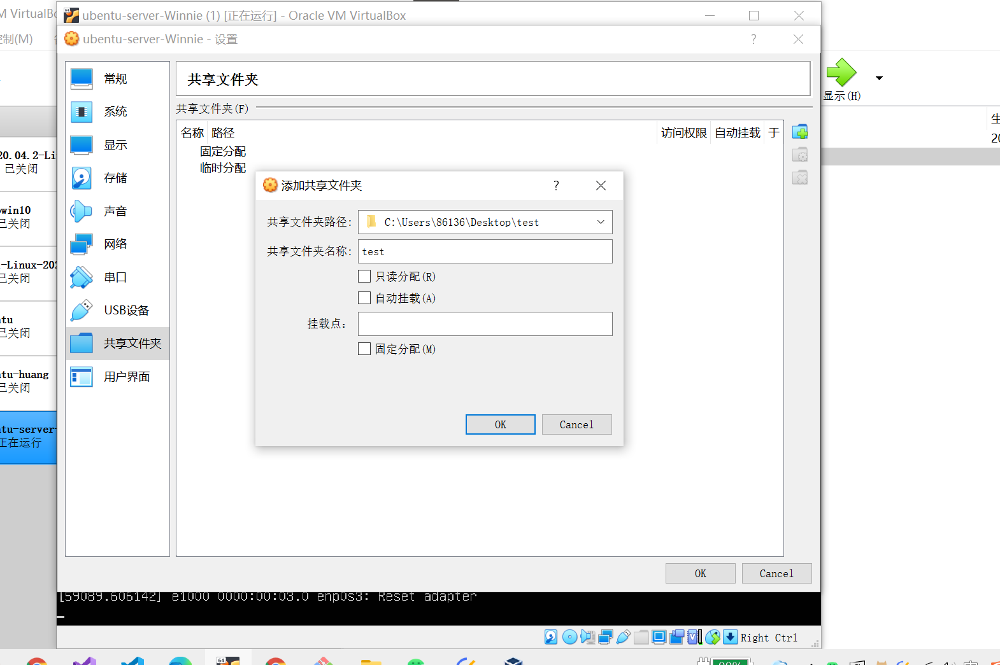
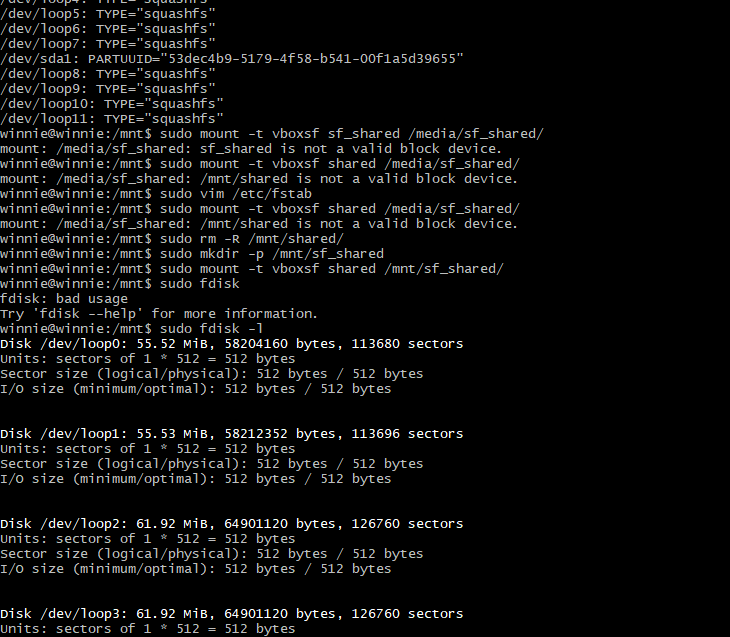
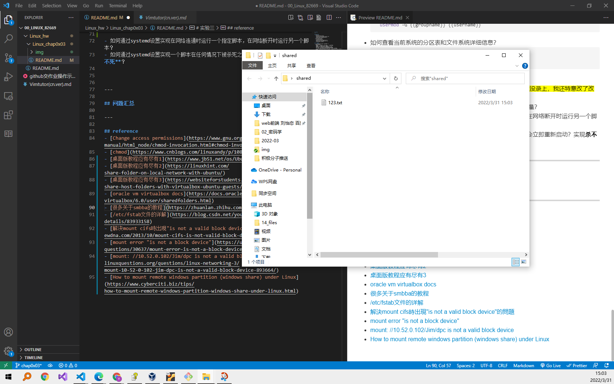
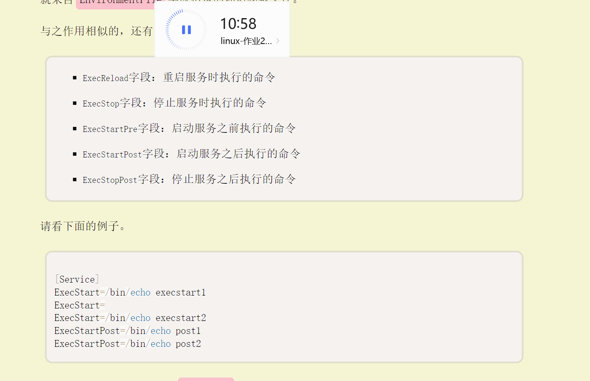
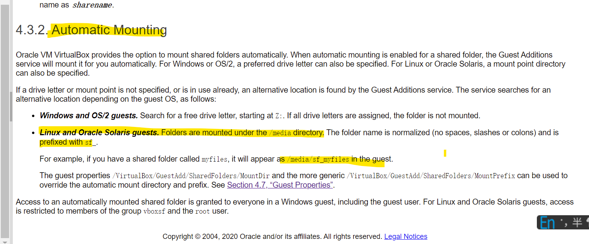
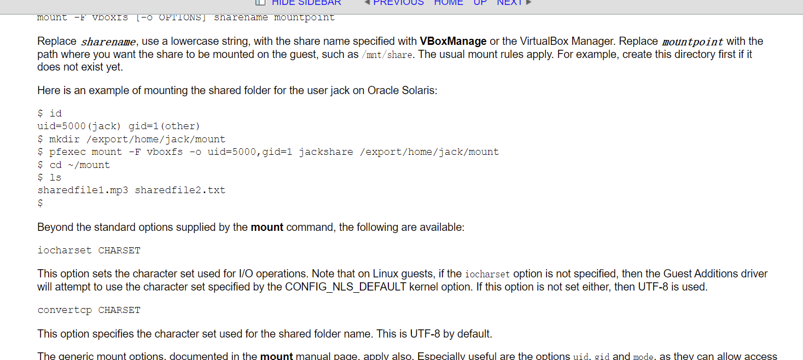
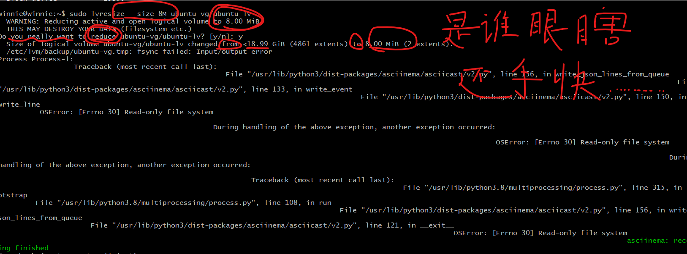
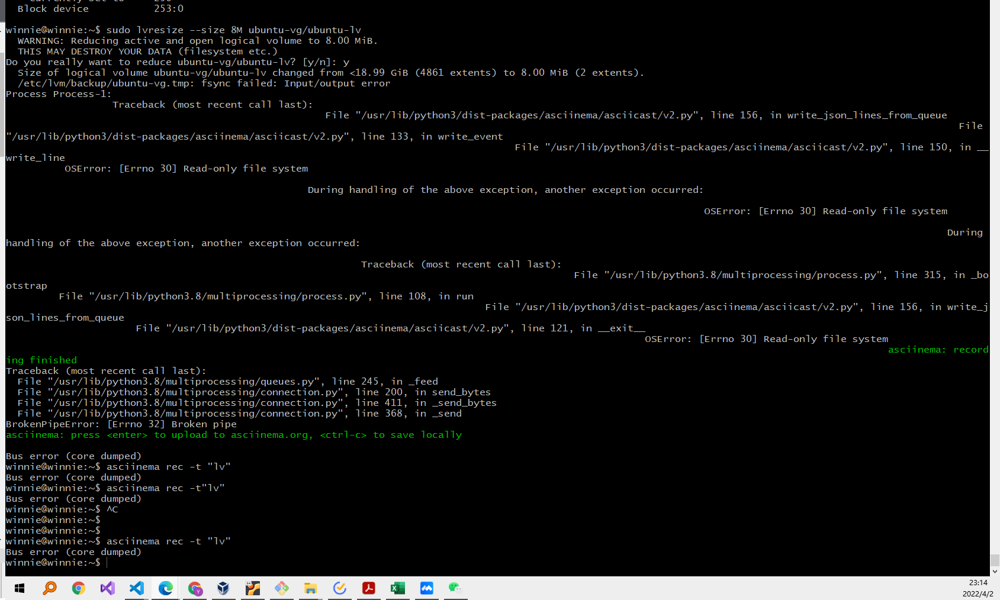
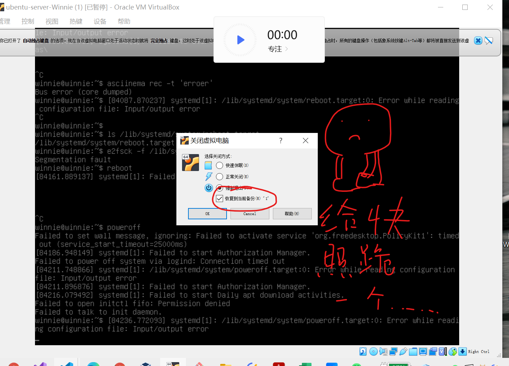

# 实验三
---

## 实验环境
- 本地虚拟机
  - virtualization:oracle
  - operating system:Ubuntu 20.04.3 LTS
  - Kernel:Linux 5.4.0-105-generic
  - architecture:x86-64
- aliyun 云起实验室
  - virtualization:kvm
  - operating system:CentOS Linux 7 
  - Kernel:inux 3.10.0-1062.18.1.el7.
  - Architecture: x86-64 

## 实验要求
- 使用 asciinema 录像学习systemd的过程
- 完成*自查清单*
  - 如何添加一个用户并使其具备sudo执行程序的权限？
  - 如何将一个用户添加到一个用户组？
  - 如何查看当前系统的分区表和文件系统详细信息？
  - 如何实现开机自动挂载Virtualbox的共享目录分区？
  - 基于LVM（逻辑分卷管理）的分区如何实现动态扩容和缩减容量？
  - 如何通过systemd设置实现在网络连通时运行一个指定脚本，在网络断开时运行另一个脚本？
  - 如何通过systemd设置实现一个脚本在任何情况下被杀死之后会立即重新启动？实现**杀不死**？
## 实验过程记录
### systemd学习
> 这个学习过程真的不知道怎么用文字描述了，如果复制粘贴下来，可能就是完整的参考文档了吧、、、
- overview
 [](https://asciinema.org/a/oREV8j6eaAQEs5sJjyYsqSGVN)
 [](https://asciinema.org/a/Yg0KRtWDkphfls7rdssWD6lYU)

- system management
    > 从这里开始，直接使用tmux，用上下panel进行本地虚拟机（Ubuntu）和云服务器（centos）同时操作，对比学习

    [](https://asciinema.org/a/fHMFNW3jG8nq0ZszLMqX8JjVr)

- unit
  [](https://asciinema.org/a/7lOShmjT4xNlr7nbgK2bMwtnM)

- unit config
  [](https://asciinema.org/a/jHKa1K6UsZFMOU1VDY6RbT2XZ)

- target
 [](https://asciinema.org/a/ho8WsbMA4pKlP45dbt8qrxr6V)

- log
  [](https://asciinema.org/a/6IbmzcQfROhYIhh9MXxp5PSpZ)

- auto start
  [](https://asciinema.org/a/v58pMQxrao8fM6LwqjEpJQ5TR)

### 自查清单
- 如何添加一个用户并使其具备sudo执行程序的权限？
  ```bash
    sudo adduser {{username}}
    chmod 4755 {{file}} # 添加SUID位 使其拥有's'的特殊权限 
  ```

  [](https://asciinema.org/a/FAdNAm6fBxusVOb84KmLAMiBk)
- 如何将一个用户添加到一个用户组？
  ```bash
    usermod -G {{groupname}} {{username}}
  ```
  [](https://asciinema.org/a/o9dKOADhAunhiAmYOo63BzhC2)
- 如何查看当前系统的分区表和文件系统详细信息？
  ```bash
    sudo fdisk -l 
    lsblk -f
  ```
  [](https://asciinema.org/a/mBh2R4xmUz3BxJCb8n5MZYCuC)
- 如何实现开机自动挂载Virtualbox的共享目录分区？
  - ```bash
    # 在虚拟机上，映射链接了宿主机上的共享文件夹后
    sudo mkdir /mnt/sf_{{foldername}} # 关于sf的前缀，好像是因为virtualbox的原因
    sudo vim /etc/fstab 
    # 修改配置文件
    virutalbox share /mnt/{{foldername}} vboxsf defaults 0 0 # defaults 本身默认的就是auto
    sudo mount -t vboxsf {{foldername}} {{mountpoint}}
    # 重启虚拟机
    ``` 
  - 过程的部分图片
     
     
     
     

  - 部分录屏（有的因为修改配置文件重启等原因，`asciinema`崩了，就没录上 :sweat:
    - [](https://asciinema.org/a/uxEfyadS5SSGc7OkninvJItMy)
    - [](https://asciinema.org/a/unChODkl2nDhqNzBB7klSSwMb)
    - [](https://asciinema.org/a/8u9G2Kec1SFP1ZgVcBsqGe9Nr)
    - [](https://asciinema.org/a/mRUIfhiHtEZkCtQir2Hbap3ZH)
    - [](https://asciinema.org/a/AH9YyRskAdguZQ6Cf20DNru5O)
    - [](https://asciinema.org/a/FNcZU3IdPVhSVWMknEHd3CAQ1)


- 基于LVM（逻辑分卷管理）的分区如何实现动态扩容和缩减容量？
  ```bash
    sudo lvresize --size {{+/-}}{{size}} --resizefs {{volume_group}/{{logical_vlomue}}}
  ```
  [](https://asciinema.org/a/UdOyMQMjg9mBoosEjezYnWzeE)

  
- 如何通过systemd设置实现在网络连通时运行一个指定脚本，在网络断开时运行另一个脚本？
  
  ```bash
  # 修改指定启动网络的配置文件
    # 通过资料和实验，锁定可能是“sys-devices-pci0000:00-0000:00:08.0-net-enp0s8.device"
  [Service]
  ExecStartPost={指定运行脚本的代码}}  #启动服务之后运行的命令
  ExesStopPost = {{指定运行的脚本代码+上一脚本停止运行命令}}  # 停止服务之后执行的命令

  ```

- 如何通过systemd设置实现一个脚本在任何情况下被杀死之后会立即重新启动？实现**杀不死**？
  ```bash
  # 法1
    # 修改配置文件
    [Service]
    Restart = always
  
  # 法2
    # 由上题
    [Service]
    ExecStopPost = systemctl enalbe {{self}}
  ```

---

## 问题汇总
- 总的来说，在自查清单的自动挂载共享文件夹这事儿上花费了很多时间
  - 首先纯共享这件事儿，本身其实还是有点不太清楚，[最后的办法见上](#自查清单)
  - 但是起初，我的想法是纯通过虚拟机和宿主机来搞定——也就是说不依赖oracle去建立共享文件夹的链接，但最终没有成功，也没有找到比较好的解决方案的文章
  - 其次，在官方文档中找到参考为应挂载在`/media` 的文件下，最终我的做法并不是，但也成功
    - 
  - 最开始按照这个解决方案，完全没有成功，但看上去很对的样子、、、
    `[oracle vm virtualbox docs](https://docs.oracle.com/en/virtualization/virtualbox/6.0/user/sharedfolders.html)
    
  - 关于为什么文件头前要加`sf`作为前缀，也还没弄明白
- 关于==眼瞎手残==这件事儿
  - 
  - 
  - 
---

## reference
- [Change access permissions](https://www.gnu.org/software/coreutils/manual/html_node/chmod-invocation.html#chmod-invocation)
- [chmod](https://www.cnblogs.com/linuxandy/p/10881918.html)
- [桌面版教程应有尽有1](https://www.jb51.net/os/Ubuntu/771586.html)
- [桌面版教程应有尽有2](https://linuxhint.com/share-folder-on-local-network-with-ubuntu/)
- [桌面版教程应有尽有3](https://websiteforstudents.com/share-host-folders-with-virtualbox-ubuntu-guests/)
- [oracle vm virtualbox docs](https://docs.oracle.com/en/virtualization/virtualbox/6.0/user/sharedfolders.html)
- [很多关于smbba的教程](https://zhuanlan.zhihu.com/p/427407222)
- [/etc/fstab文件的详解](https://blog.csdn.net/youmatterhsp/article/details/83933158)
- [解決mount cifs時出現"is not a valid block device"的問題](https://www.ewdna.com/2013/10/mount-cifs-is-not-valid-block-device.html)
- [mount error "is not a block device"](https://unix.stackexchange.com/questions/30637/mount-error-is-not-a-block-device)
- [mount: //10.52.0.102/Jim/dpc is not a valid block device](https://www.linuxquestions.org/questions/linux-networking-3/mount-10-52-0-102-jim-dpc-is-not-a-valid-block-device-893664/)
- [How to mount remote windows partition (windows share) under Linux](https://www.cyberciti.biz/tips/how-to-mount-remote-windows-partition-windows-share-under-linux.html)