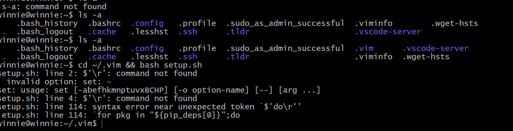
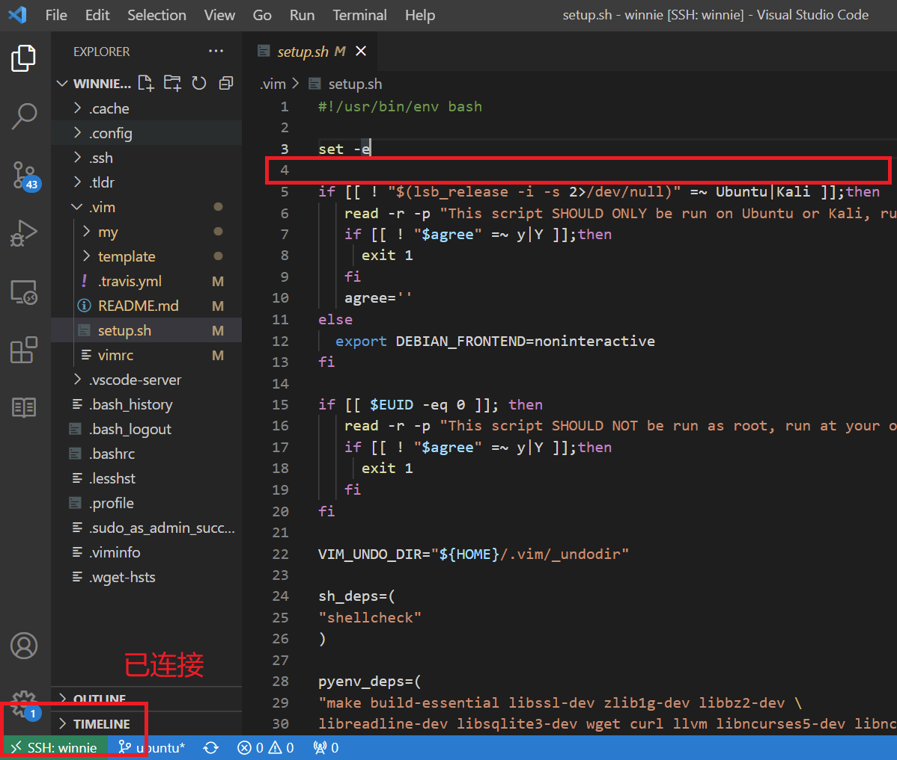
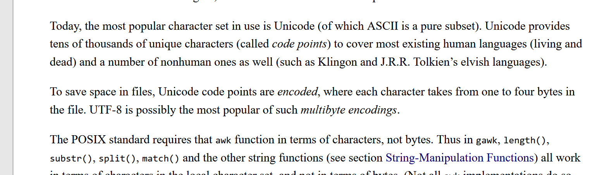
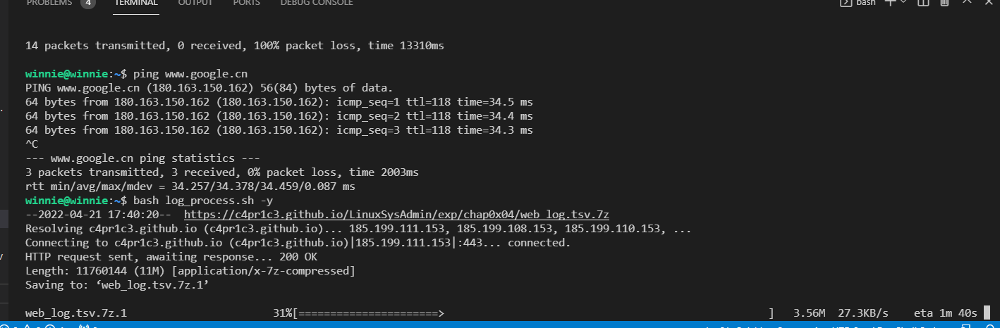
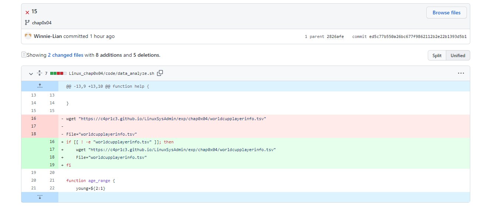
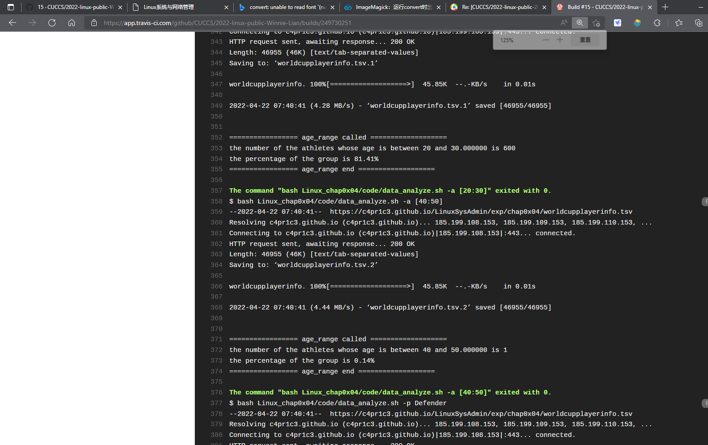
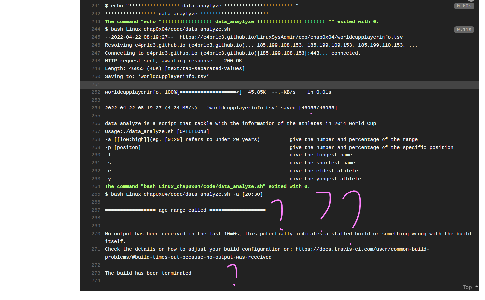
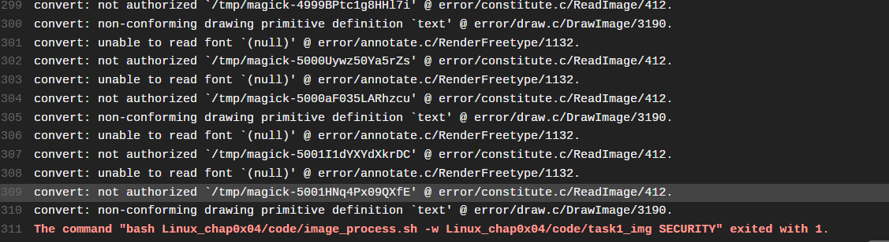
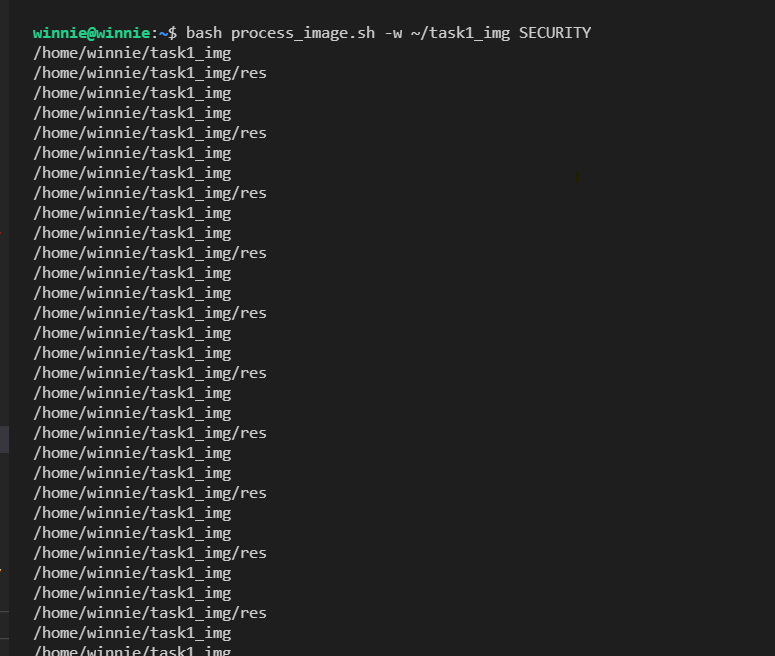
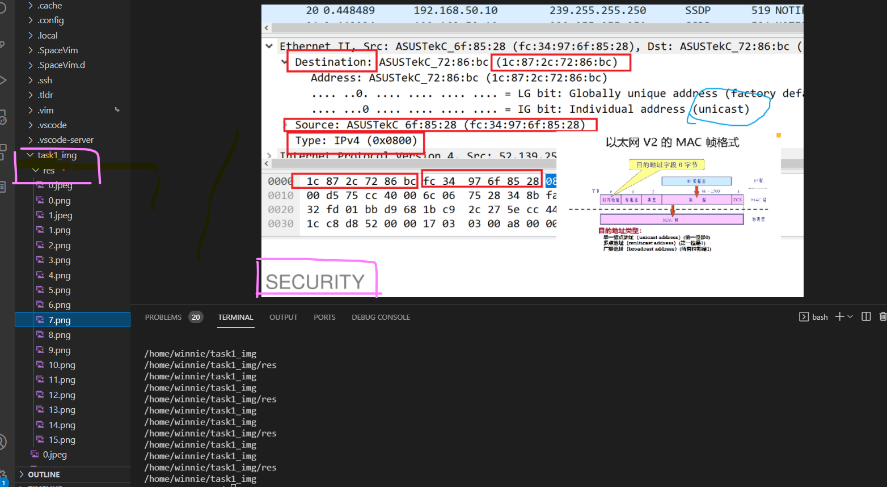

# 实验四
---
## 实验环境
- 本地虚拟机
  - virtualization:oracle
  - operating system:Ubuntu 20.04.3 LTS
  - Kernel:Linux 5.4.0-105-generic
  - architecture:x86-64
  - bash virsion:GNU bash, version 5.0.17(1)-release (x86_64-pc-linux-gnu)

<!-- aliyun 云起实验室
virtualization:kvm
operating system:CentOS Linux 7
Kernel:inux 3.10.0-1062.18.1.el7.
Architecture: x86-64 -->

## 实验要求
---
- 任务一：用bash编写一个图片批处理脚本，实现以下功能：
  - 支持命令行参数方式使用不同功能
  - 支持对指定目录下所有支持格式的图片文件进行批处理
  - 支持以下常见图片批处理功能的单独使用或组合使用
  - 支持对jpeg格式图片进行图片质量压缩
  - 支持对jpeg/png/svg格式图片在保持原始宽高比的前提下压缩分辨率
  - 支持对图片批量添加自定义文本水印
  - 支持批量重命名（统一添加文件名前缀或后缀，不影响原始文件扩展名）
  - 支持将png/svg图片统一转换为jpg格式图片

- 任务二：用bash编写一个文本批处理脚本，对以下附件分别进行批量处理完成相应的数据统计任务：
  - 2014世界杯运动员数据
  - 统计不同年龄区间范围（20岁以下、[20-30]、30岁以上）的球员数量、百分比
  - 统计不同场上位置的球员数量、百分比
  - 名字最长的球员是谁？名字最短的球员是谁？
  - 年龄最大的球员是谁？年龄最小的球员是谁？
- 任务三：用bash编写一个文本批处理脚本，对以下附件分别进行批量处理完成相应的数据统计任务：
  - Web服务器访问日志
  - 统计访问来源主机TOP 100和分别对应出现的总次数
  - 统计访问来源主机TOP 100 IP和分别对应出现的总次数
  - 统计最频繁被访问的URL TOP 100
  - 统计不同响应状态码的出现次数和对应百分比
  - 分别统计不同4XX状态码对应的TOP 10 URL和对应出现的总次数
  - 给定URL输出TOP 100访问来源主机

## 实验记录
<hr>

### 预处理
- 安装spacevim提供良好的编程环境
- 同时也按照课程视频，有配置好vscode相关环境，安装了相关插件（以便时间来不及，vim学习成本过高时，及时回归、、、
- 准备好一个图片文件夹
  - 这里直接使用【计算机网络】实验7 的图片记录文件夹
  - 通过`scp {{path}} host@host:{{path}}` 复制到虚拟机中
    - > 由于上次后续实验导致虚拟机挂掉，基于时间关系，暂缓处理共享文件夹的问题

---
### 过程
- [输出结果在这里](./output.md)
- 演示过程如下
  - image_process:[](https://asciinema.org/a/ZYrSMNFC01kYSYHwFDHHEbe10) 
  - data_analyze:[](https://asciinema.org/a/buPTzhceCDZJTB8FzldTKEIgm)
  - log_process:[](https://asciinema.org/a/aQdzaTPKch5KVaXcz3F55rQTf)


### 问题
> 由于有的已经解决后遗忘，暂列部分

- 安装vimrc时出现的问题
  
  
  - 他好像认为这里有个字符，但事实上我在vscode中打开并没有发现，最后这个问题不了了之
  - **解决方案**：安装了`vimspace`
    <hr>

- 【task2】关于“最长名字的运动员”
  - 有关上课提到排序使用字节长度，还是字符长度的问题，由于采用`awk`读取，而`awk`会自动进行unicode编码，因此，这里是字符长度进行排序

  <hr>

- 原本是想直接获取两个url中的内容，然后直接在虚拟环境中跑的，但是猜测可能因为当时没有科学上网的原因？（虽然好像有点荒谬，因为我觉得Travis的运行应该跟我本地的网络连接无关）当时，测试得到的结果是获取时直接timeout，然后就会返回错误了，所以本地测试了一下下载速度显示确实很慢，所以想要直接上传
导致的结果是，（这里忘记截图了），push一直失败，后来通过讨论区发现过大文件无法上传，于是又回归通过url直接获取的方式
最终，没有原因的就成功了😇

<hr>

- 这是两次push修改的部分
  然而，前一次Travis error如下后一次如下
  就是说很想知道，这里为什么卡、、、、 
  ```bash
  if [[ ! -e "worldcupplayerinfo.tsv" ]]; then
    wget "https://c4pr1c3.github.io/LinuxSysAdmin/exp/chap0x04/worldcupplayerinfo.tsv"
    File="worldcupplayerinfo.tsv"
  fi
    function age_range {
      young=${2:1}
      young=${young%:*}
      # echo $young    
      old=${2#*:}
      len=${#old}
      old=${old:0:$((len-1))}
      # echo $old
      count=0
      number=0
      awk -F '\t' 'BEGIN{ print "\n================= age_range called ==================="; } { num++; if($6>=yo && $6<=ol)co++; } END{ printf("the number of the athletes whose age is between %d and %f is %d\n", yo,ol,co);printf("the percentage of the group is %.2f%s\n", (co/num)*100,"%" );printf("================= age_range end ===================\n\n"); }' yo=$young ol=$old co=$count num=$number "$File"
    }
  ```
  如果已经运行了begin中的语句，证明已经进入调用函数的部分，而两次函数调用完全没有任何修改，所以感到很迷幻而且无从下手debug
>已解决
<hr>

- 添加水印，虚拟机中可以很好的运行，而Travis报错，且完成查询相关解决方案时，大多情况是基于【'】【"】混用导致，而这里不存在这情况，至此没有解决
    
    
    


### reference(partial)
- [spacevim.org](https://spacevim.org/quick-start-guide/#installation)
- [Bash Array](https://www.gnu.org/software/bash/manual/html_node/Arrays.html)
- [imagemagick](https://imagemagick.org/script/download.php)
- [rename_1](https://stackoverflow.com/questions/208181/how-to-rename-with-prefix-suffix)
- [我是真的觉得很帮倒忙的帮助文档😐(好吧，还是很有用的)](https://itpcb.com/linux/c/awk.html)
- [Linux awk命令详解](http://c.biancheng.net/view/4082.html)
- [The GNU Awk User’s Guide](http://www.gnu.org/software/gawk/manual/gawk.html#String-Functions)
- [awk 使用教程 - 通读篇（30分钟入门）](https://cloud.tencent.com/developer/article/1159061)
- [awk：一个强大的文本分析工具 ](https://linux.cn/article-13177-1.html)
- [awk 入门教程](https://www.ruanyifeng.com/blog/2018/11/awk.html)
- [AWK command in Unix/Linux with examples](https://www.geeksforgeeks.org/awk-command-unixlinux-examples/)
- [持续集成服务 Travis CI](https://www.ruanyifeng.com/blog/2017/12/travis_ci_tutorial.html)