# chap0x05

---

## 实验环境
- 本地虚拟机
  - virtualization:oracle
  - operating system:Ubuntu 20.04.3 LTS
  - Kernel:Linux 5.4.0-105-generic
  - architecture:x86-64
  - bash virsion:GNU bash, version 5.0.17(1)-release (x86_64-pc-linux-gnu)
- 软件环境
  - Nginx
  - VeryNginx
  - Wordpress[4.7]
  - Damn Vulnerable Web Application

--- 

## 实验要求
###  基本要求
- 在一台主机（虚拟机）上同时配置Nginx和VeryNginx
  - VeryNginx作为本次实验的Web App的反向代理服务器和WAF
  - PHP-FPM进程的反向代理配置在nginx服务器上，VeryNginx服务器不直接配置Web站点服务
- 使用Wordpress搭建的站点对外提供访问的地址为： http://wp.sec.cuc.edu.cn
- 使用Damn Vulnerable Web Application (DVWA)搭建的站点对外提供访问的地址为： http://dvwa.sec.cuc.edu.cn

### 安全加固要求
- 使用IP地址方式均无法访问上述任意站点，并向访客展示自定义的友好错误提示信息页面-1
- Damn Vulnerable Web Application (DVWA)只允许白名单上的访客来源IP，其他来源的IP访问均向访客展示自定义的友好错误提示信息页面-2
- 在不升级Wordpress版本的情况下，通过定制VeryNginx的访问控制策略规则，热修复WordPress < 4.7.1 - Username Enumeration
- 通过配置VeryNginx的Filter规则实现对Damn Vulnerable Web Application (DVWA)的SQL注入实验在低安全等级条件下进行防护

### VeryNginx配置要求
- VeryNginx的Web管理页面仅允许白名单上的访客来源IP，其他来源的IP访问均向访客展示自定义的友好错误提示信息页面-3
- 通过定制VeryNginx的访问控制策略规则实现：
  - 限制DVWA站点的单IP访问速率为每秒请求数 < 50
  - 限制Wordpress站点的单IP访问速率为每秒请求数 < 20
  - 超过访问频率限制的请求直接返回自定义错误提示信息页面-4
  - 禁止curl访问

---

## 实验过程记录

### 环境配置
- 安装veryNginx
```bash
# 克隆仓库
git clone  https://github.com/alexazhou/VeryNginx.git
# 以下步骤参考官方文档及课程视频更正（及摸索
cd VeryNgix 
sudo apt install -y gcc 
sudo apt install -y pcre pcre-devel
sudo apt install -y openssl openss-devel
sudo apt install -y libpcre3 libpcre3-dev
sudo apt install -y zlib1g-dev lua-zlib lua-zlib-dev
# 这里当时踩了坑，等待很久发现安装需要写进 /opt/verynginx，要使用sudo给予权限
sudo python install.py install
```
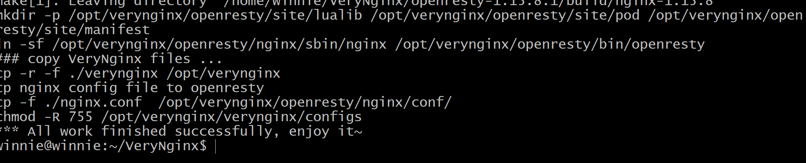

- 安装WordPress
  - 下载好安装包，复制进入目录后
  - 参考资料 [How to Install WordPress with LEMP on Ubuntu 20.04](https://www.digitalocean.com/community/tutorials/how-to-install-wordpress-with-lemp-on-ubuntu-20-04) 进行安装
  - 配置WordPress前需要Prerequisites
    - [Initial Server Setup with Ubuntu 20.04](https://www.digitalocean.com/community/tutorials/initial-server-setup-with-ubuntu-20-04)
    ```bash 
        # skip part of ‘add user’ for worrying about what if make some trouble with user of previlige
        
        # check for fire wall
        sudo ufw app list 
            Available applications:
                Nginx Full
                Nginx HTTP
                Nginx HTTPS
                OpenSSH     # 已经有openssh
        # check status
        sudo ufw status
        # output:inactive
        sudo ufw enable

        # 这里再次确认了一下 status，没有启动openssh
        sudo ufw allow openssh
        sudo ufw status

        # done
    ``` 
    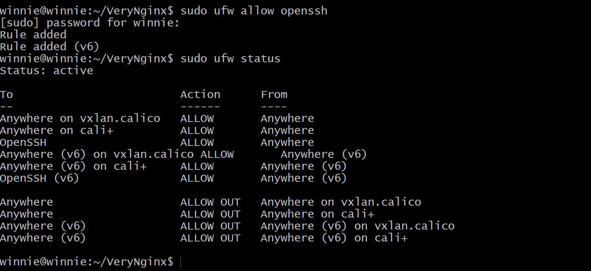
    - [How To Install Linux, Nginx, MySQL, PHP (LEMP stack) on Ubuntu 20.04](https://www.digitalocean.com/community/tutorials/how-to-install-linux-nginx-mysql-php-lemp-stack-on-ubuntu-20-04)
    ```bash
        # install and activate Nginx
        sudo apt update
        sudo apt install nginx
        sudo ufw app list
        sudo ufw allow 'Nginx HTTP'

        # install MySQL
        sudo apt install mysql-server
        sudo mysql_secure_installation
        # 设置密码处出了问题（fig0），通过直接设置密码解决
        # 另一窗口
        sudo mysql
             ALTER USER 'root'@'localhost' IDENTIFIED WITH mysql_native_password by 'mypassword';

        # install php
        sudo apt install php-fpm php-mysql

        # Configuring Nginx to Use the PHP Processor
        sudo mkdir /var/www/winnie_lian
        sudo chown -R $USER:$USER /var/www/{{my_domain}}
        sudo nano /etc/nginx/sites-available/{{my_domain}}
            server {
                listen 80;
                server_name your_domain www.your_domain;
                root /var/www/your_domain;

                index index.html index.htm index.php;

                location / {
                    try_files $uri $uri/ =404;
                }

                location ~ \.php$ {
                    include snippets/fastcgi-php.conf;
                    fastcgi_pass unix:/var/run/php/php7.4-fpm.sock;
                }

                location ~ /\.ht {
                    deny all;
                }

            }     
          sudo ln -s /etc/nginx/sites-available/{{my_domain}} /etc/nginx/sites-enabled/

        sudo unlink /etc/nginx/sites-enabled/default

        sudo nginx -t
        sudo systemctl reload nginx

        # Testing Database Connection from PHP (Optional)
        sudo mysql
            CREATE DATABASE example_database;
    ``` 
    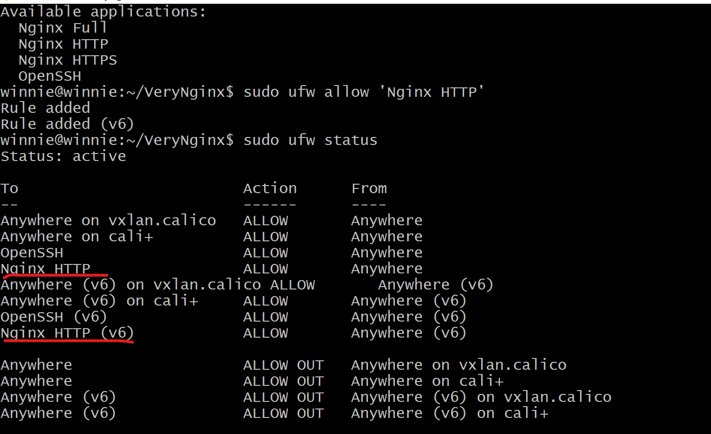
    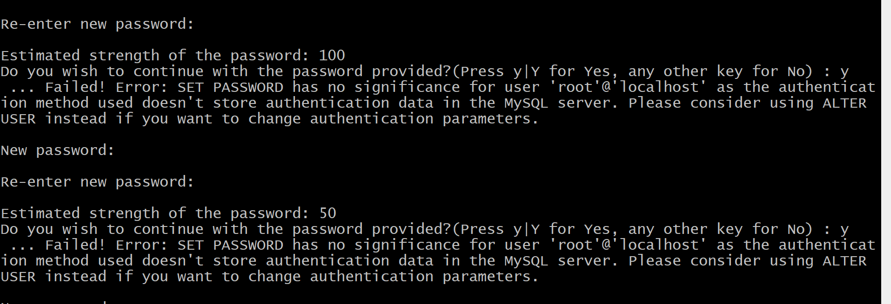
    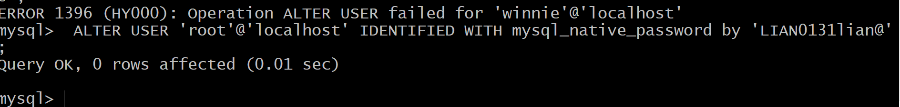
    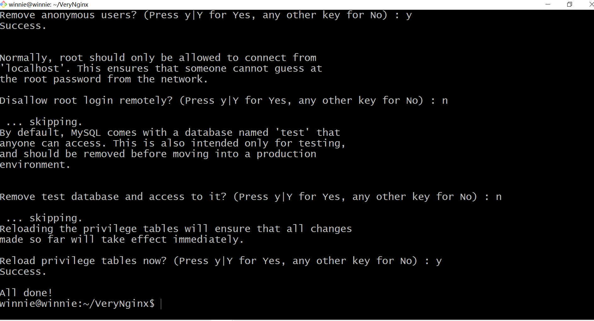
    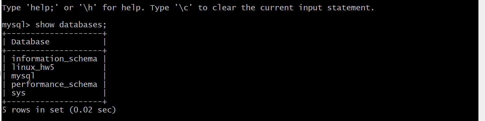
  -  Installing Additional PHP Extensions
   ```bash
    sudo apt install php-curl php-gd php-intl php-mbstring php-soap php-xml php-xmlrpc php-zip
    sudo systemctl restart php7.4-fpm
   ```  
   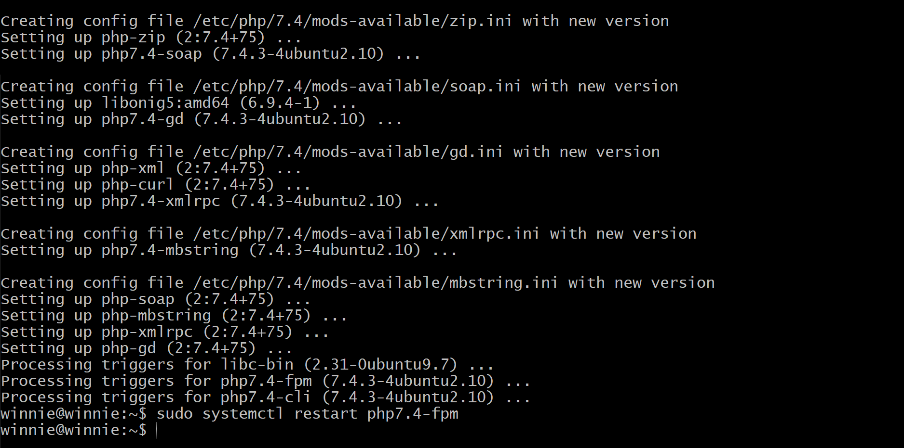
  - Downloading WordPress
   ```bash
    cd /tmp
    curl -LO https://wordpress.org/latest.tar.gz
    # 确认一下确实存在
    ls
    tar xzvf latest.tar.gz
    cp /tmp/wordpress/wp-config-sample.php /tmp/wordpress/wp-config.php
    sudo cp -a /tmp/wordpress/. /var/www/winnie_lian
    sudo chown -R www-data:www-data /var/www/winnie_lian
   ``` 
   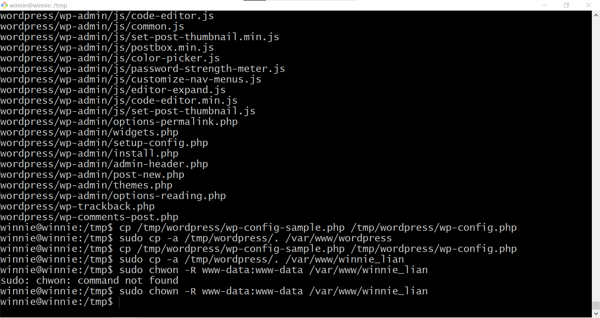
  - Setting up the WordPress Configuration File
   ```bash
    curl -s https://api.wordpress.org/secret-key/1.1/salt/
    sudo nano /var/www/winnie_lian/wp-config.php
   ``` 
   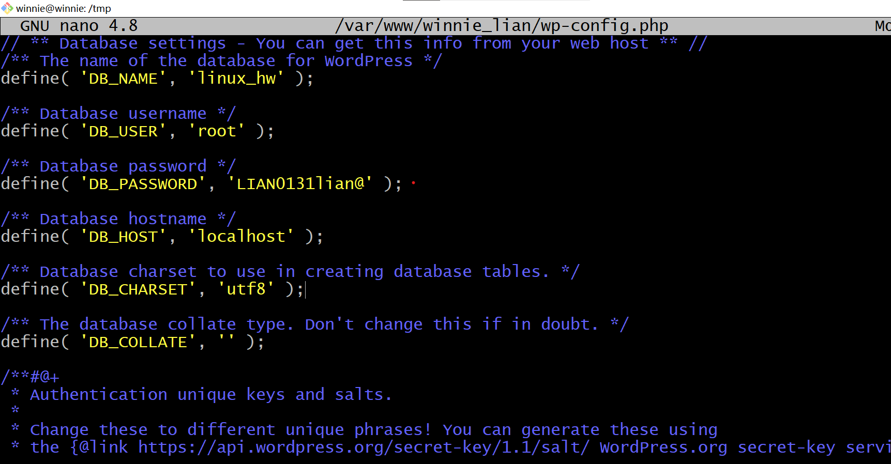

[](https://asciinema.org/a/G1dqnOsq6iJ4gMClrt7mnky28)

- 修改配置文件
```bash
    sudo vim /opt/verynginx/openresty/nginx/conf/nginx.conf
    # 把ip固定为host-only的网卡上，方便通过宿主机进行浏览图形化界面
```
-  启动verynginx
```bash
sudo /opt/verynginx/openresty/nginx/sbin/nginx 
```
- 宿主机访问成功
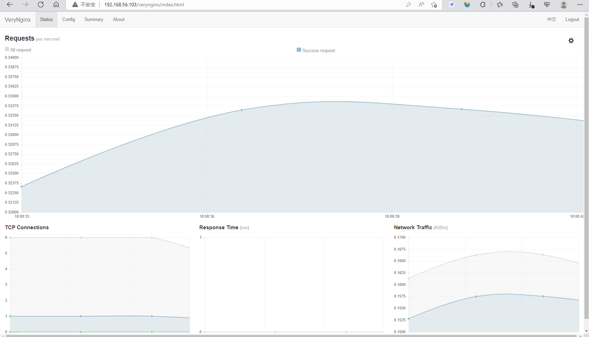
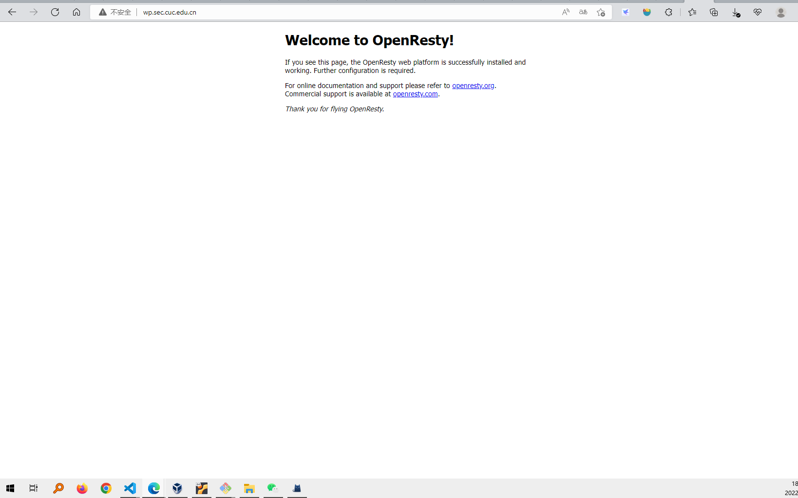

### 实验问题
- 一个坑？ 为避免端口冲突，当时准备修改verynginx的端口，然后发现一直访问不了，卡住很久，后来才知道，80端口是浏览器的默认端口，由于是用verynginx作为反向代理服务器，所以应该修改nginx更优，这样才能顺利访问

### reference
- [[Solved] Failed! Error: SET PASSWORD has no significance for user ‘root’@’localhost’ as the authentication method used doesn’t store authentication data in the MySQL server](https://exerror.com/failed-error-set-password-has-no-significance-for-user-rootlocalhost-as-the-authentication-method-used-doesnt-store-authentication-data-in-the-mysql-server/)
